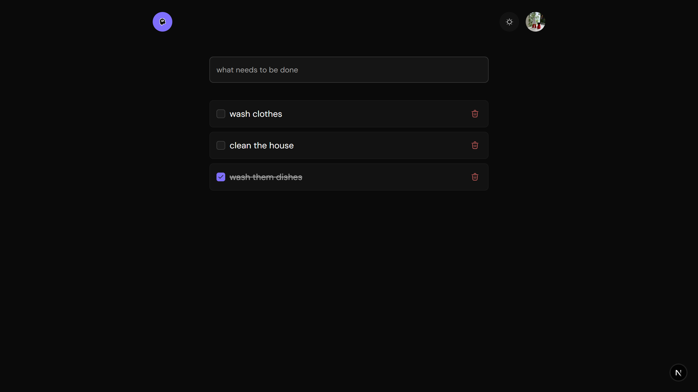

# 🔄 Realtime Todo App

A realtime todo application built with a modern stack:

- ⚡️ **JStack** - The stack for building seriously fast, lightweight and end-to-end typesafe Next.js apps.
- 🔐 **BetterAuth** - The most comprehensive authentication framework for TypeScript.
- 🧠 **PostgreSQL** — Persistent todo storage
- 📡 **Pusher** — Realtime updates across tabs/devices
- 🌐 **React + TailwindCSS + ShadCn UI + motion** — Sleek, animated UI
- 📦 **TanStack Query (React Query)** — Data fetching and caching

---

## ✨ Features

- ✅ Add, toggle, and delete todos
- 🔄 Realtime sync between multiple browser tabs or devices
- 🔒 Authenticated with BetterAuth
- ⚡️ Serverless and edge-compatible
- 🎨 Smooth animations with `motion`
- 💻 Dev-friendly structure using `jstack`

---

## 📸 Preview



---

---

## 🚀 Tech Stack

| Layer         | Tech                         |
|---------------|------------------------------|
| Frontend      | React, TailwindCSS, Motion   |
| Backend       | Hono, jstack, BetterAuth     |
| Auth          | BetterAuth                   |
| Database      | PostgreSQL + Prisma ORM      |
| Realtime      | Pusher (client + server SDK) |
| Dev Tooling   | TypeScript, ESLint, Prettier |

---

## 🛠 Setup Instructions

### 1. Clone the repo

```bash
git clone https://github.com/R4heem-Orekoya/realtime-todo

cd realtime-todo-app
```
### 1.  Install dependencies
```bash
pnpm install
```

### 2. Configure `.env`
```bash
BETTER_AUTH_SECRET="secret"
BETTER_AUTH_URL="http://localhost:3000"
DATABASE_URL='dbUrl'
GITHUB_CLIENT_ID=""
GITHUB_CLIENT_SECRET=""
PUSHER_APP_ID = ""
NEXT_PUBLIC_PUSHER_KEY = ""
PUSHER_SECRET = ""
```

### 3. Generate Prisma Client
```bash
pnpm prisma generate
```

### 4.  Run Locally
```bash
pnpm dev
```